# Version 3

## The Introduction

Our cloud documentation is almost always out of date. It's not because we're lazy; it's because the cloud moves too fast. A diagram drawn in a sprint planning meeting is obsolete by the time the code hits production. This documentation crisis, that  every engineering team faces, is a massive and invisible tax. Nobody talks about it, but we know that manual updates are expensive, error-prone, and always outdated when you need them most. The "cost" isn't just the 2-3 days of senior engineer time every quarter—it's the production incidents that could have been prevented, the security vulnerabilities you didn't know existed, and the new hires who take weeks to understand the system.

I was tired of this cycle. So I built a solution that uses AI agents to automatically scan live AWS environments and generate accurate, multi-audience documentation in minutes—not days. Here's how it works, what I learned, and why this approach unlocks something bigger than just better diagrams.

## The Problem

<aside>
💡

Why Everything We've Tried Has Failed

</aside>

- ❌ Manual Documentation
    
    **The promise:** "We'll keep the wiki updated"
    **The reality:** Updated once during setup, referenced never, trusted by no one
    **The cost:** 2-3 days of senior engineer time per environment, outdated within weeks
    
- ❌ Diagrams-as-Code (Terraform/CloudFormation diagrams)
    
    **The promise:** "Our IaC is our documentation"
    **The reality:** Shows the *intended* state, not the actual state after three hotfixes and that manual console change on Friday night
    **The gap:** What you *planned* vs. what actually *exists*
    
- ❌ Static Scanning Tools
    
    **The promise:** "We'll scan your infrastructure"
    **The reality:** Dumps 10,000 lines of JSON that tell you *what* exists but not *why* or *how it's connected.*
    

## The Solution

<aside>
💡

AI Agents That Understand Infrastructure

</aside>

What we actually needed is a system that can perceive infrastructure like a scanner, understand it like a senior architect, and explain it like a technical writer—automatically. To achieve this, I created a "crew" of specialized AI agents—each with a specific job, just like a real engineering team.

Think of it like this:

- **The Inspector** scans AWS (like a junior engineer running AWS CLI commands)
- **The Analyst** understands relationships (like a senior architect reviewing configs)
- **The Draftsman** creates diagrams (like a technical illustrator)
- **The Writers** create documentation for different audiences:
    - Technical Writer → detailed runbook for ops teams
    - Executive Analyst → high-level summary for leadership
    - Developer Advocate → practical guide for developers

All working in parallel, all generating outputs from the same live data, all in minutes.

## The Transformation

<aside>
💡

Before vs. After

</aside>

| Aspect | Before ( Manual Process ) | After ( Automated with AI Agents ) |
| --- | --- | --- |
| ⏱️ **Time** | 2-3 days per environment | 5-10 minutes per environment |
| 👤 **Who** | Senior engineer (expensive) | Anyone with AWS access |
| 📄 **Output** | One diagram, maybe a doc | Diagram + 4 tailored documents |
| 🔄 **Update Frequency** | Quarterly if you're lucky | On-demand or automated (CI/CD) |
| 🎯 **Accuracy** | Outdated within weeks | Always reflects current state |
| 😰 **Stress Level** | High (always out of date) | Low (always accurate) |

## Quick Start

The entire system is open source. You can have it running in 5 minutes:

```bash
# 1. Install the package
git clone https://github.com/kirponik/aws-architecture-diagrams-with-crewai
cd aws-architecture-diagrams-with-crewai
pip install -e .

# 2. Run it (that's it!)
aws-diagram-generator \
  --name "Production" \
  --region us-east-1 \
  --tags "Environment=prod" "App=myapp"

# 3. Check your output/ directory for complete documentation
```

**Prerequisites:** 

- Python 3.10+
- AWS credentials
- AWS Config enabled
- AWS Bedrock access (Claude 3.5 Sonnet **preferred** )

In under 10 minutes, you'll have:

- ✅ PlantUML architecture diagram with AWS icons
- ✅ Technical Runbook with every resource detail
- ✅ Executive Summary in plain English
- ✅ Developer Onboarding Guide with endpoints

## How It Actually Works

Three Key Innovations:

- **Universal Discovery**
    
    This works with ANY AWS Service. The first breakthrough was realizing we don't need to hard-code `describe_instances()`, `describe_db_instances()`, etc. for every service. Instead, use AWS's universal APIs:
    
    ```python
    # This one API call finds ANY tagged resource across ALL services
    paginator = tagging_client.get_paginator('get_resources')
    for page in paginator.paginate(TagFilters=boto3_tag_filters):
        resources = page.get('ResourceTagMappingList', [])
        all_resource_mappings.extend(resources)
    ```
    
    **Why this matters:**
    
    - Works with services that didn't exist when you wrote the code. No maintenance as AWS adds new services.
    
- **Batch Processing**
    
    The second breakthrough was batching AWS Config calls instead of fetching resources one-by-one:
    
    ```python
    # Group by type
    resources_by_type: Dict[str, List] = {}
    for resource in resources:
        resource_type = extract_resource_type_from_arn(arn)
        resources_by_type[resource_type].append(resource)
    
    # Fetch up to 20 at once
    response = config_client.batch_get_resource_config(
        resourceKeys=resource_keys  # Batch of 20
    )
    
    # Automatic fallback for edge cases
    if error_code == 'ValidationException':
        config_client.select_resource_config(
            Expression=f"SELECT * WHERE configuration.arn = '{safe_arn}'"
        )
    ```
    
    **Why this matters:**
    
    - Processes 100s of resources in seconds
    - Built-in retry logic for throttling
    - Automatic fallback when batch isn't supported

- **AI Understanding**
    
    The third breakthrough was using specialized AI agents with personas:
    
    ```python
    inspector = Agent(
        role='AWS Infrastructure Inspector',
        goal='Scan AWS and provide detailed JSON of resources',
        backstory='You use AWS APIs to discover cloud resources based on tags.',
        tools=[aws_scanner_tool],
        llm=llm
    )
    
    analyst = Agent(
        role='Cloud Architecture Analyst',
        goal='Understand architecture, components, and relationships',
        backstory='You interpret raw infrastructure data and structure it into a logical model.',
        llm=llm
    )
    
    draftsman = Agent(
        role='PlantUML Diagram Draftsman',
        goal='Generate PlantUML diagram scripts',
        backstory='You convert architectural information into PlantUML using AWS icons.',
        llm=llm
    )
    
    # Chain them together: Inspector → Analyst → Draftsman
    task_inspect = Task(description='Scan AWS...', agent=inspector)
    task_analyze = Task(description='Analyze...', agent=analyst, context=[task_inspect])
    task_draw = Task(description='Create diagram...', agent=draftsman, context=[task_analyze])
    
    crew = Crew(agents=[...], tasks=[...])
    result = crew.kickoff()
    ```
    
    **Why this matters:**
    
    - Each agent is an expert in its domain
    - Outputs are human-readable, not raw JSON
    - Same data → 4 different perspectives (technical, executive, developer, visual)

## The Architecture

<aside>
💡

How It All Fits Together

```mermaid
flowchart TD
      Start([Your AWS Cloud<br/>Live Environment])

      Start -->|ResourceGroupsTaggingAPI<br/>+ AWS Config| Inspector

      subgraph Crew[AI Agent Crew - CrewAI Orchestration]
          Inspector[🔍 Inspector<br/>Scans & Collects]
          Analyst[🧠 Analyst<br/>Understands Relationships]

          subgraph Parallel[Parallel Documentation Generation]
              Draftsman[🎨 Draftsman<br/>PlantUML Diagrams]
              TechWriter[📝 Tech Writer<br/>Technical Runbook]
              ExecAnalyst[👔 Exec Analyst<br/>Executive Summary]
              DevAdvocate[💻 Dev Advocate<br/>Developer Guide]
          end

          Aggregator[📦 Aggregator<br/>Combines All Outputs]

          Inspector -->|Raw JSON Data| Analyst
          Analyst -->|Architecture Analysis| Draftsman
          Analyst -->|Infrastructure Data| TechWriter
          Analyst -->|Infrastructure Data| ExecAnalyst
          Analyst -->|Infrastructure Data| DevAdvocate

          Draftsman --> Aggregator
          TechWriter --> Aggregator
          ExecAnalyst --> Aggregator
          DevAdvocate --> Aggregator
      end

      Aggregator --> Output

      Output([📄 Complete Documentation Package<br/>━━━━━━━━━━━━━━━━━━━<br/>✓ Architecture Diagram<br/>✓ Technical Infrastructure Runbook<br/>✓ Executive Summary for Leadership<br/>✓
  Developer Onboarding Guide])

      style Start fill:#64b5f6,stroke:#0d47a1,stroke-width:3px,color:#000
      style Crew fill:#ffcc80,stroke:#e65100,stroke-width:2px,color:#000
      style Output fill:#81c784,stroke:#1b5e20,stroke-width:3px,color:#000
      style Inspector fill:#42a5f5,stroke:#01579b,stroke-width:2px,color:#000
      style Analyst fill:#9575cd,stroke:#311b92,stroke-width:2px,color:#000
      style Parallel fill:#fff59d,stroke:#f57f17,stroke-width:2px,color:#000
      style Aggregator fill:#f06292,stroke:#880e4f,stroke-width:2px,color:#000
      style Draftsman fill:#4dd0e1,stroke:#006064,stroke-width:2px,color:#000
      style TechWriter fill:#aed581,stroke:#33691e,stroke-width:2px,color:#000
      style ExecAnalyst fill:#ffb74d,stroke:#e65100,stroke-width:2px,color:#000
      style DevAdvocate fill:#ba68c8,stroke:#4a148c,stroke-width:2px,color:#000
```

</aside>



## What You Actually Get

<aside>
💡

Here's what the final markdown file can look like

</aside>

```markdown
# AWS Architecture Documentation: Production Environment

## Table of Contents
1. Architecture Diagram
2. Technical Infrastructure Runbook
3. Executive Summary for Leadership
4. Developer Onboarding Guide

## Architecture Diagram
@startuml
!include <awslib/AWSCommon>
!include <awslib/Compute/EC2>
!include <awslib/Database/RDS>

rectangle "VPC: vpc-12345 (10.0.0.0/16)" {
  rectangle "Public Subnet: subnet-abc" {
    ElasticLoadBalancing(alb, "Application LB", "")
  }
  rectangle "Private Subnet: subnet-def" {
    EC2(web1, "Web Server 1", "t3.medium")
    EC2(web2, "Web Server 2", "t3.medium")
  }
  rectangle "DB Subnet: subnet-ghi" {
    RDS(db, "PostgreSQL", "db.t3.large")
  }
}

alb --> web1
alb --> web2
web1 --> db
web2 --> db
@enduml

## Technical Infrastructure Runbook

### Compute Resources
**EC2 Instance: i-0abc123** (Web Server 1)
- Instance Type: t3.medium
- Private IP: 10.0.1.10
- Security Groups: sg-web123 (allows 80/443 from ALB)
- IAM Role: web-server-role
- Tags: Environment=production, Tier=web

[... detailed configs for every resource ...]

## Executive Summary
This production environment hosts our customer-facing web application using a
highly available, three-tier architecture. The system consists of:

- **Web Tier:** Redundant web servers behind a load balancer for high availability
- **Database Tier:** Managed PostgreSQL database with automated backups
- **Security:** Private subnets, restricted security groups, encrypted data

The architecture supports approximately 10,000 daily users with 99.9% uptime...

## Developer Onboarding Guide
### Quick Start
**Application URL:** <https://my-app-prod-123.us-east-1.elb.amazonaws.com>

**Database Connection:**
```bash
Host: mydb.cluster-abc.us-east-1.rds.amazonaws.com
Port: 5432
Database: production_db
User: app_user

## **Environment Variables:**
[... practical connection details ...]
```

## 💭 Final Thoughts and Next Steps

This approach is powerful, but it's not magic. Here are the real-world considerations:

1. **Dependency:** The `AWS Config` discovery method is robust, but it relies on AWS Config being enabled and correctly configured to record all the resource types you care about.
2. **Cost:** This makes heavy use of a powerful LLM (like Claude 3.5 Sonnet or GPT-4). Running it on-demand is fine, but running it every 10 minutes on a massive environment could get expensive.
3. API Rate Limits:  AWS Bedrock has very strong limits, especially on Anthropic Models ( 1-2 requests per minute). To work around we use models via inference profile. Also the Use-Case submission is required. 
4. **Non-Determinism:** LLMs are non-deterministic. The `Analyst` might occasionally misinterpret a relationship or the `Draftsman` might make a syntax error. This requires prompt refinement and testing.

Once you have AI agents that can perceive and understand your infrastructure, you unlock an entire category of use cases:

- **Cost Optimization**
    
    ```python
    finops_analyst = Agent(
        role='FinOps Analyst',
        goal='Identify cost optimization opportunities',
        backstory='You find abandoned or over-provisioned resources.'
    )
    # Output: "Found 5 unattached EBS volumes costing $150/month"
    #         "RDS instance at 12% CPU could be downsized, save $200/month"
    ```
    

- **Security Auditing**
    
    ```python
    security_auditor = Agent(
        role='Security Auditor',
        goal='Identify security vulnerabilities',
        backstory='You audit cloud configurations for compliance.'
    )
    # Output: "Security group sg-123 allows 0.0.0.0/0 on port 22"
    #         "S3 bucket 'backups' is not encrypted"
    #         "RDS instance publicly accessible"
    ```
    

- **Compliance Verification**
    
    ```python
    compliance_checker = Agent(
        role='Compliance Checker',
        goal='Verify HIPAA/PCI-DSS/SOC2 compliance'
    )
    # Output: "HIPAA Violation: Database not in private subnet"
    #         "PCI-DSS: Encryption at rest not enabled"
    ```
    

## 📚 Resources

- 📦 **GitHub:** [aws-architecture-diagrams-with-crewai](https://github.com/)
- 🛠️ **Tools Used:** [CrewAI](https://docs.crewai.com/) | [AWS Config](https://docs.aws.amazon.com/config/) | [PlantUML](https://plantuml.com/)
- 🎨 **AWS Icons:** [aws-icons-for-plantuml](https://github.com/awslabs/aws-icons-for-plantuml)
- CrewAI GitHub Examples: [https://github.com/crewAIInc/crewAI-examples](https://github.com/crewAIInc/crewAI-examples)